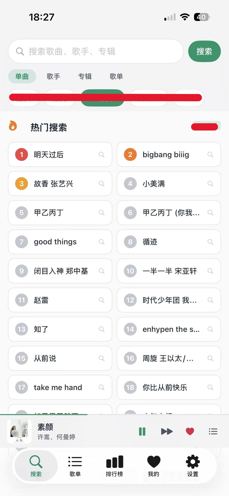
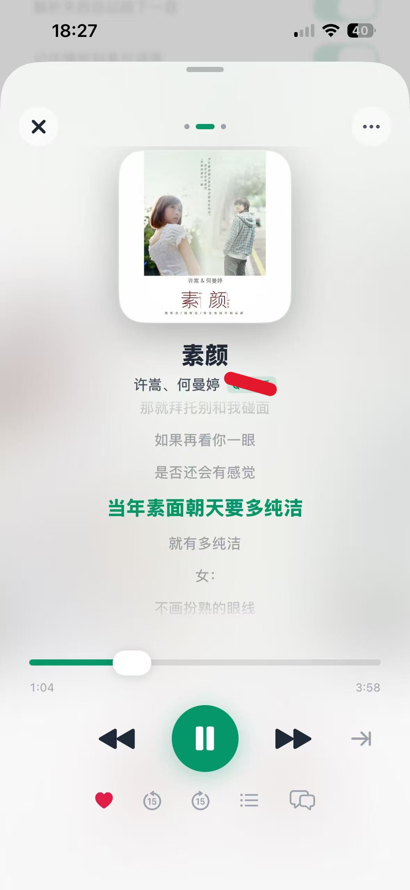
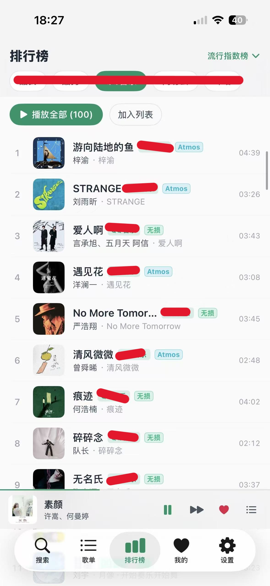
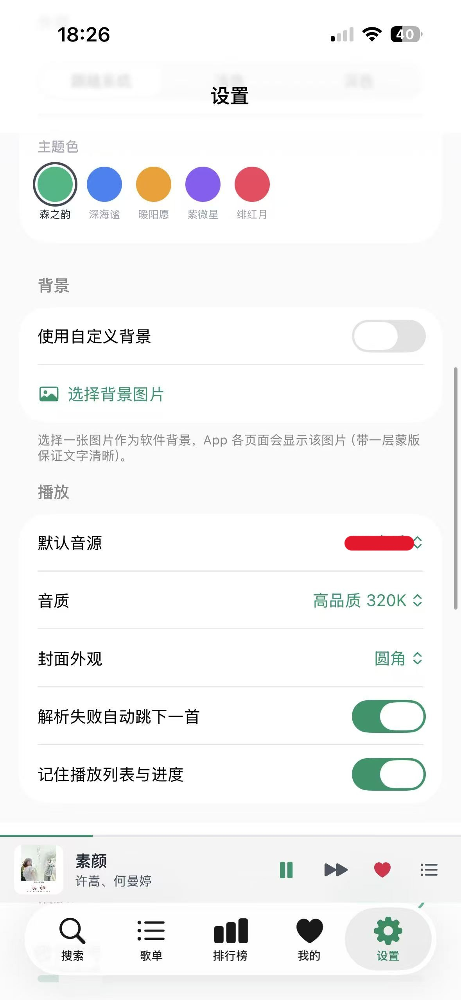

  

<h1 align="center">LXMusic iOS 客户端</

> 由于 lxserver 的 WebUI 在 iOS 系统上存在使用限制，而 X流、X头音乐 等基于 Subsonic 协议的第三方客户端体验也不够理想，因此使用 WorkBuddy、Trae 等 AI 编程工具编写了这款 iOS 客户端，作为更顺手的移动端方案。安装包以 IPA 形式分发，需侧载到 iOS 设备使用。

本项目**极度依赖**后端服务 [lxserver](https://github.com/XCQ0607/lxserver)。**没有 lxserver，本客户端将无法使用**。仅在 iPhone 16 iOS 26.6 测试过。

---

## 功能特性

- **iOS 26 图标 & 应用内切换**：内置 iOS 26 风格主图标与经典图标，设置页支持一键切换，已适配 iOS 26 主屏渲染（避免备用图标「白底黑线」）。
- **歌曲详情 & 跨平台歌手 / 专辑跳转**：歌曲信息页可点击跳转到歌手与专辑。QQ / 网易云在对应平台搜索并自动进入歌手 / 专辑详情页（封面正常加载）；酷狗 / 酷我 / 咪咕本平台不支持歌手 / 专辑检索，自动跳转网易云搜索页。
- **歌曲评论**：评论区支持多平台切换，查看不同来源听众的讨论。
- **自定义音源**：可在「设置」中添加自定义音源，支持公开 / 私有，与后端保持一致，并可调整优先级。
- **后端账号同步**：登录后端服务后，「我的」页面与收藏等内容可在设备间同步。
- **多账号切换**：修复多账号切换逻辑，退出二次确认，并修复账号栏按钮误触。
- **投屏播放**：支持通过 DLNA 将音频投射到局域网内的播放设备。（没有 DLNA 设备，没测试过）
- **全新 VLC 内核 & 双内核切换（无损 FLAC 支持）**：集成 MobileVLCKit 内核，完美兼容无损 FLAC 音质（iOS 原生内核在 FLAC 下存在时间轴兼容问题）；设置页「播放」区可在 iOS 原生内核 与 VLC 内核 之间切换；引擎层重构为 AudioEngine 协议 + AVPlayer/VLC 双后端，修复冷启动续播、切歌无声等问题。
- **锁屏 / 控制中心歌词**：采用与 QQ 音乐、网易云一致的「字段复用」方案，锁屏标题显示「歌名 - 歌手」，歌手行显示当前歌词并随播放逐行滚动；设置页「歌词」区新增开关（默认开启）。
- **增加歌词校正**：全局歌词校正，并正确解析 LRC `[offset:]` 标签，支持拖动实时预览。
- **个性化界面**：可自定义应用背景图、主题与音质偏好等。
- **本地缓存**：支持歌曲缓存与批量管理（多选删除、清空）。

---

## 截图

| 搜索 | 主要播放页 |
| --- | --- |
|  |  |
| 排行榜 | 设置 |
|  |  |

---

## 安装

本项目提供已构建的安装包 `LXMusic-iOS-Client.ipa`。由于 iOS 系统限制，IPA 需通过侧载方式安装到设备：

1. 下载本仓库中的 `LXMusic-iOS-Client.ipa`；
2. 自行使用 iOS 应用侧载 / 自签名方式将其安装到设备；
3. 若使用免费个人证书，安装可能在 7 天后失效，重新侧载即可继续使用。

> 本应用未上架 App Store，仅以 IPA 形式分发。

---

## 配置数据服务（必须）

本项目**极度依赖**后端服务 [lxserver](https://github.com/XCQ0607/lxserver)。**没有 lxserver，本客户端将无法使用**。

客户端需要在「设置」中填写一个可用的 lxserver 服务地址（或自行部署 lxserver）后才能正常连接数据、加载内容与使用完整功能。自定义音源、账号同步、我的收藏等均建立在 lxserver 之上。

---

## 免责声明

本项目仅供个人学习、研究与技术交流使用，**不内置、不提供任何受版权保护的音频资源**，也不鼓励任何形式的侵权使用。使用者须遵守所在地区的法律法规，并自行承担因使用本项目所产生的一切后果。请支持正版音乐。

---

## 许可证

本项目以个人 / 学习用途为前提分发。如需用于其他用途，请遵循对应的许可协议与当地法规。
